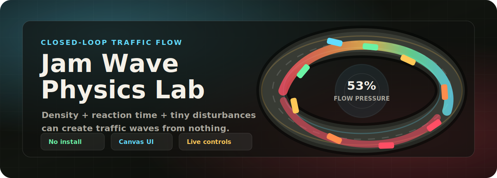

<p align="center">
  
</p>

<h1 align="center">Traffic Jam Physics Lab</h1>

<p align="center">
  A cinematic browser simulation where phantom traffic jams emerge from driver behavior, density, and tiny disturbances.
</p>

<p align="center">
  
  
  
</p>

<p align="center">
  <a href="https://grey-neutral.github.io/traffic_jam_simulation/"><strong>Test the live simulation</strong></a>
</p>

## What It Does

Traffic jams do not always need crashes, cones, or bad roads. This lab shows how a small braking ripple can travel backward through a closed-loop road and become a stop-and-go wave.

Under the hood, each car follows an intelligent-driver style car-following model. The simulation updates live as you tune density, target speed, reaction time, acceleration, braking, minimum gap, driver variation, and disturbance.

## Highlights

| Watch | Tune | Read |
| --- | --- | --- |
| Glowing cars, velocity trails, congestion heat, wave echoes, and sensor gates. | Vehicles, road length, speed, reaction time, braking, gaps, variation, disturbance, and time scale. | Average speed, flow, density, jam index, elapsed time, and a scrolling speed field. |

## Run It

Open `index.html` directly in a browser, or serve the folder locally:

```bash
python3 -m http.server 4173
```

Then visit `http://127.0.0.1:4173/index.html`.

## Try This

Raise `Vehicles`, increase `Reaction Time`, then click `Trigger Jam Pulse`. If the loop is dense enough, the slowdown keeps moving even after the original cause disappears.
